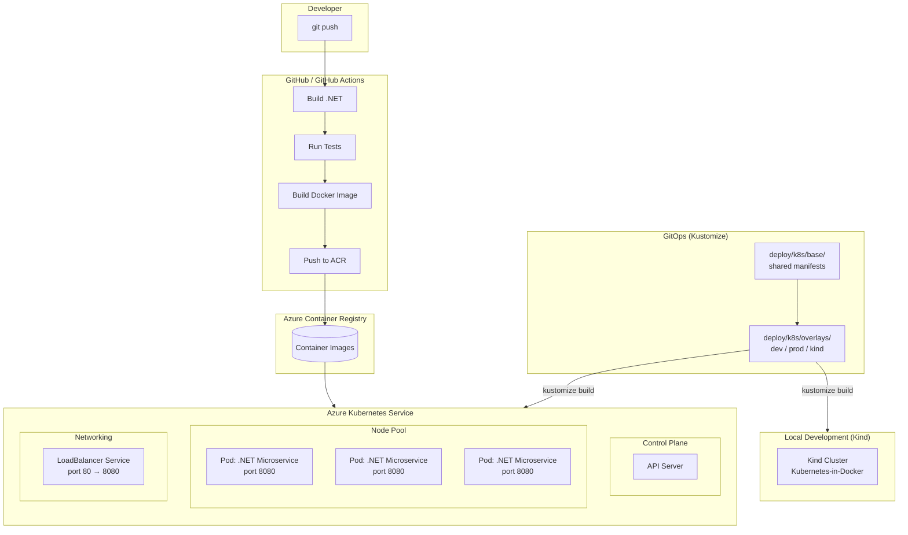
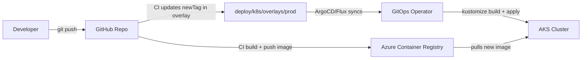

# Cloud-Native .NET Microservice — Azure 

[](https://github.com/your-org/azure-dotnetservice/actions/workflows/deploy.yml)

A practical example of deploying a containerized .NET microservice to **Azure Kubernetes Service (AKS)** using **GitHub Actions** and **Azure Pipelines** — most pipeline stages run without needing actual resource provisioning, so you can validate builds, tests, security scans, and policy checks even without an Azure subscription.

## What This Project Offers

| Area | How It Helps |
|------|-------------|
| **Faster Time-to-Market** | Automated CI/CD pipelines reduce manual overhead, helping teams ship features more quickly. |
| **Smoother Deployments** | Rolling updates with health checks help keep your application available during updates. |
| **Cost Awareness** | Container resource limits and cluster auto-scaling help match infrastructure to actual demand. |
| **Developer-Friendly** | A local Kind environment mirrors production AKS, so you can validate Kubernetes deployments before pushing changes. |
| **Consistent Experience** | The same container images and Kubernetes manifests work across dev, staging, and production. |
| **Flexible Foundations** | Kubernetes abstraction means your workloads can run on AKS, EKS, GKE, or on-premises with minimal changes. |

## Architecture



## Design Approach

### Scalability
- **Horizontal Pod Autoscaling** — The microservice is stateless, making it a good fit for HPA based on CPU and memory metrics. You can configure replica counts in `deploy/k8s/deployment.yaml`.
- **Resource Requests and Limits** — CPU (100m/250m) and memory (128Mi/256Mi) guardrails help prevent any single workload from affecting others in shared clusters.
- **Stateless by Design** — No session affinity needed; any pod can handle any request. State can be stored in Azure services (databases, Redis, and so on) when the need arises.

### Reliability
- **Health Probes** — Liveness checks (every 15s) restart pods that aren't responding. Readiness checks (every 10s) make sure traffic only reaches healthy pods.
- **Rolling Updates** — With `maxUnavailable: 0` and `maxSurge: 1`, new pods come online before traffic shifts — helping keep your service available during updates.
- **Automatic Restart** — Containers are configured to restart automatically if they fail, reducing the need for manual intervention.

### Security
- **Immutable Infrastructure** — No SSH access to pods. Configuration is baked into container images or injected through environment variables.
- **Thoughtful Image Pulls** — `IfNotPresent` policy helps avoid unnecessary registry pulls while keeping things secure.
- **Least Privilege** — Containers run without elevated permissions. Network policies can further limit inter-pod communication if needed.
- **Policy-as-Code (3 layers)** — Azure Policy helps prevent non-compliant resources from being created, Checkov and tfsec scan infrastructure code during CI, and OPA validates `terraform plan` against custom Rego policies — offering multiple opportunities to catch configuration concerns before they reach production.

### Observability
- **Health Endpoint** — The `/health` endpoint returns HTTP 200 when the application is ready, working with both Kubernetes probes and Azure Monitor.
- **Structured Logging** — ASP.NET Core logs are written to stdout and stderr, where they can be collected by Azure Monitor or Fluentd and explored in Log Analytics.
- **Distributed Tracing** — The service includes OpenTelemetry instrumentation, making it easier to trace requests across microservices.

### CI/CD
- **Adaptable Pipelines** — Build and test run on every PR. Azure deployment steps activate only when credentials are available, making the project friendly for forks and contributors.
- **Predictable Deployments** — Using `kustomize build | kubectl apply -f -` keeps manifests declarative and safe to re-run.
- **GitOps-Friendly** — Image tags live in Kustomize overlays rather than being baked into manifests. The CI pipeline updates the tag in the prod overlay, ready for tools like ArgoCD or Flux to sync.

## What's Demonstrated

| Capability | Live Azure | Local (Kind) |
|------------|:----------:|:-------------:|
| .NET build and test | ✅ | ✅ |
| Docker container build | ✅ | ✅ |
| Push to Azure Container Registry | ✅ | — |
| Deploy to AKS | ✅ | — |
| Deploy to local Kind cluster | — | ✅ |
| Rolling updates with health probes | ✅ | ✅ |
| GitHub Actions CI/CD | ✅ | ✅ (build + dry-run) |
| Azure Pipelines CI/CD | ✅ | ✅ (build + dry-run) |
| tfsec IaC security scanning | ✅ | ✅ |
| Checkov compliance scanning with custom policies | ✅ | ✅ |
| OPA policy-as-code (terraform plan gate) | ✅ | ✅ |
| Azure Policy definitions (preventive controls) | ✅ | — |

## DevSecOps and Policy-as-Code

This project applies multiple layers of security validation throughout the software delivery lifecycle — an approach sometimes called "defense in depth" for infrastructure configuration.

### Three-Layer Policy Model

| Layer | Tool | When It Runs | What It Helps With |
|-------|------|------|------------------|
| **Preventive** | Azure Policy | Before resource creation | Guides Azure to reject configurations that don't meet your standards (like ACR admin users or AKS clusters without RBAC). |
| **Shift-Left** | Checkov + tfsec | CI pipeline (PR) | Scans Terraform code for common misconfigurations before they're merged. |
| **Plan-Time** | OPA / Rego | `terraform plan` | Checks the planned infrastructure against your organization's custom policies. |

### What Each Resource is Checked For

| Resource | Check | Layer |
|----------|-------|-------|
| Azure Container Registry | Public network access disabled | Checkov |
| Azure Container Registry | Admin user disabled | Azure Policy (Deny) |
| Azure Container Registry | Premium SKU required | OPA |
| Azure Container Registry | Network rules default deny | OPA |
| Azure Container Registry | CMK encryption required | Azure Policy (Audit) |
| AKS | API server IP restrictions | Checkov + OPA |
| AKS | RBAC + Azure AD RBAC enabled | Azure Policy (Deny) + OPA |
| AKS | Azure Defender / OMS agent enabled | Azure Policy (DeployIfNotExists) |
| AKS | HTTP routing disabled | Checkov |
| Key Vault | Purge protection enabled | Azure Policy (Deny) |
| Key Vault | Soft delete retention >= 7 days | Checkov |
| Key Vault | Firewall rules configured | OPA |
| Key Vault | RBAC authorization enabled | OPA |

The idea is to catch configuration concerns early, while still having safeguards at the Azure platform level. If any scan or policy check finds something that needs attention, the pipeline pauses so it can be reviewed.

## Project Structure

```
.
├── src/CloudNativeMicroservice/      # .NET 8 Web API
├── argocd/                           # ArgoCD declarative config
│   ├── kustomization.yaml            # Kustomize bundle for all ArgoCD resources
│   ├── project.yaml                  # AppProject (RBAC scoping)
│   ├── application.yaml              # Production Application (sync policy, ignore diffs)
│   ├── application-dev.yaml          # Dev environment Application
│   └── application-kind.yaml         # Local Kind Application
├── .github/workflows/deploy.yml      # GitHub Actions pipeline
├── azure-pipelines.yml               # Azure DevOps pipeline
├── deploy/k8s/
│   ├── base/                         # Shared Kubernetes manifests
│   │   ├── kustomization.yaml
│   │   ├── namespace.yaml            # sync-wave: 0
│   │   ├── deployment.yaml           # sync-wave: 1
│   │   └── service.yaml              # sync-wave: 1
│   ├── overlays/
│   │   ├── dev/                      # Dev environment (1 replica)
│   │   │   └── kustomization.yaml
│   │   ├── prod/                     # Production (3 replicas, HPA, PDB, NetworkPolicy)
│   │   │   ├── kustomization.yaml
│   │   │   ├── hpa.yaml              # sync-wave: 2
│   │   │   ├── pdb.yaml              # sync-wave: 2
│   │   │   └── network-policy.yaml   # sync-wave: 2
│   │   └── kind/                     # Local Kind overlay (local image tag)
│   │       └── kustomization.yaml
│   ├── deployment.yaml               # Standalone manifest (backward compat)
│   └── service.yaml                  # Standalone manifest (backward compat)
├── scripts/local-demo.sh             # Full local demo script
├── docker-compose.yml                # Local container testing
├── Dockerfile                        # Multi-stage container build
└── Makefile                          # Task runner
```

## Try It Without Azure

### Prerequisites

- [Docker](https://docker.com)
- [Kind](https://kind.sigs.k8s.io) — `go install sigs.k8s.io/kind@latest`
- [.NET 8 SDK](https://dotnet.microsoft.com/download)

### One-command demo

```bash
make kind-demo
```

This walks through the full flow: building the application, running tests, building a Docker image, creating a Kind cluster, deploying the Kubernetes manifests, and testing the API endpoint.

### Step by step

```bash
# Build and test locally
make build && make test

# Run via Docker
make docker-run

# Deploy to local Kind cluster
make kind-up
make kind-deploy

# Tear down
make kind-destroy
```

### Manual script

```bash
./scripts/local-demo.sh
```

## Deploy to Azure (when a subscription is available)

### GitHub Actions

Set these [repository secrets](https://docs.github.com/en/actions/security-guides/using-secrets-in-github-actions):

| Secret | Purpose |
|--------|---------|
| `AZURE_CREDENTIALS` | Azure service principal (JSON) |
| `ACR_LOGIN_SERVER` | e.g. `myacr.azurecr.io` |
| `ACR_USERNAME` | ACR admin username |
| `ACR_PASSWORD` | ACR admin password |
| `AKS_CLUSTER_NAME` | AKS cluster name |
| `AKS_RESOURCE_GROUP` | AKS resource group |

The workflow runs **build + test** on every push. It only pushes to ACR and deploys to AKS when the right secrets are configured.

### Azure Pipelines

Set pipeline variables (`acrLoginServer`, `aksClusterName`, and so on) through the Azure DevOps portal. The pipeline skips the Deploy stage if AKS isn't configured.

## GitOps Extension

This project follows **GitOps** practices. Kubernetes manifests use **Kustomize** overlays for environment-specific settings, with image tags kept separate from the base manifests — a pattern that fits well with pull-based GitOps workflows.

### GitOps Principles in Practice

| Principle | How It's Applied |
|-----------|---------------|
| **Declarative configuration** | All Kubernetes resources live as YAML in `deploy/k8s/`. |
| **Version controlled** | Everything is in Git, giving you a full history of changes. |
| **Image tag separation** | Base manifests use a generic image reference; overlays set the specific tag via Kustomize. |
| **Environment consistency** | The same base manifests work across dev, prod, and kind — only overlay values differ. |
| **Ready for drift detection** | Namespace, labels, and selectors are structured for GitOps tools like ArgoCD or Flux. |
| **Safe to re-run** | `kustomize build | kubectl apply -f -` is idempotent. |

### Trying ArgoCD

The `argocd/` directory has declarative manifests to register the application with ArgoCD. Update the repository URL in the application manifests to match your fork, then:

```bash
# Apply all ArgoCD resources at once via Kustomize
make argocd-apply

# Or apply individually
kubectl apply -f argocd/project.yaml
kubectl apply -f argocd/application.yaml       # production
kubectl apply -f argocd/application-dev.yaml    # development
kubectl apply -f argocd/application-kind.yaml   # local Kind
```

ArgoCD will sync the `deploy/k8s/overlays/prod` Kustomize overlay and:
- Create the `cloud-native-microservice` namespace (sync-wave 0)
- Deploy the Deployment and Service (sync-wave 1)
- Apply HPA, PDB, and NetworkPolicy (sync-wave 2)
- Prune resources that no longer exist in Git
- Self-heal if manual changes are detected

#### Sync Wave Ordering

| Wave | Resources | Purpose |
|------|-----------|---------|
| 0 | Namespace | Needs to exist before other resources |
| 1 | Deployment, Service | Core workload and networking |
| 2 | HPA, PDB, NetworkPolicy | Depends on the deployment being present |

#### Ignoring Differences

The Application is configured to ignore fields that Kubernetes may adjust on its own:
- `spec.replicas` on Deployments (so HPA can manage replica count)
- `spec.metrics` on HPAs (to allow for cluster-specific metric variations)

### Trying Flux

```bash
flux bootstrap github \
  --owner=your-org \
  --repository=azure-dotnetservice \
  --path=deploy/k8s/overlays/prod \
  --personal
```

Once the operator is installed, the CI pipeline (`update-gitops-manifest` job in `.github/workflows/deploy.yml`) builds the image, pushes it to ACR, and updates the `newTag` in `deploy/k8s/overlays/prod/kustomization.yaml`. The operator notices the change and syncs the cluster automatically.

### Kustomize Overlay Reference

| Overlay | Image | Replicas | Extra Resources | Use Case |
|---------|-------|----------|-----------------|----------|
| `overlays/dev` | `myacr.azurecr.io/...:latest` | 1 | — | Development |
| `overlays/prod` | `myacr.azurecr.io/...:<sha>` | 3 | HPA, PDB, NetworkPolicy | Production |
| `overlays/kind` | `cloud-native-microservice:local` | 1 | — | Local Kind testing |

### GitOps Architecture (with ArgoCD/Flux)



### Why GitOps Works Well Here

| Benefit | How It Applies |
|---------|----------------|
| **Audit Trail** | Every manifest change is a Git commit — clear history of what changed and when. |
| **Drift Detection** | GitOps tools can compare cluster state to Git and flag any differences. |
| **Multi-Environment** | Separate branches or directories for dev, staging, and production with promotion through pull requests. |
| **Disaster Recovery** | Point a new cluster at the repository and the entire workload can be restored. |
| **PR-Based Updates** | Open a pull request to change replica counts or image tags; merging triggers the sync. |

## Kubernetes Manifests

| File | Description |
|------|-------------|
| `base/deployment.yaml` | Shared deployment — RollingUpdate, `/health` probes, resource limits |
| `base/service.yaml` | Shared ClusterIP service on port 80 → container port 8080 |
| `base/namespace.yaml` | Dedicated `cloud-native-microservice` namespace |
| `overlays/prod/hpa.yaml` | CPU and memory-based Horizontal Pod Autoscaler (3–10 replicas) |
| `overlays/prod/pdb.yaml` | Pod Disruption Budget (min 2 available during voluntary disruptions) |
| `overlays/prod/network-policy.yaml` | Ingress traffic limited to pods in the same namespace |
| `argocd/project.yaml` | ArgoCD AppProject with source and destination RBAC scoping |
| `argocd/kustomization.yaml` | Kustomize bundle to apply all ArgoCD resources at once |
| `argocd/application.yaml` | ArgoCD Application (prod) with sync policy, retry, and ignore-differences |
| `argocd/application-dev.yaml` | ArgoCD Application (dev) pointing to dev overlay |
| `argocd/application-kind.yaml` | ArgoCD Application (kind) pointing to local overlay |
