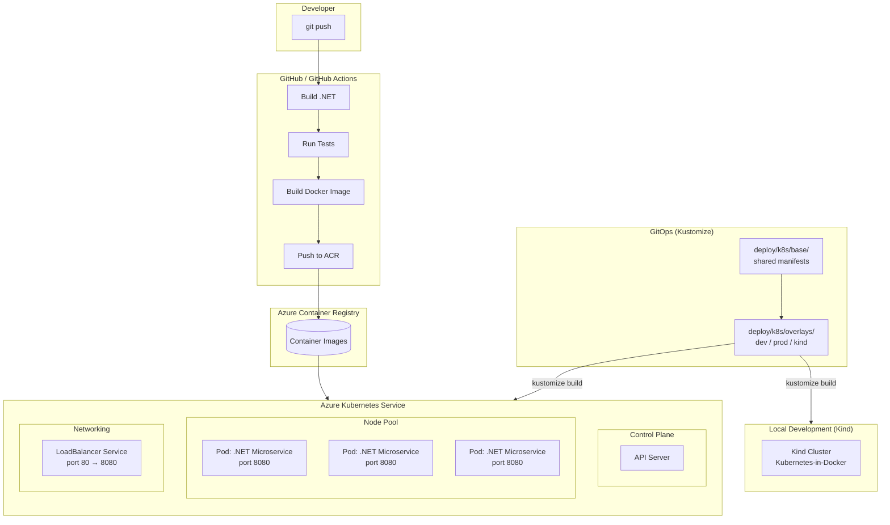
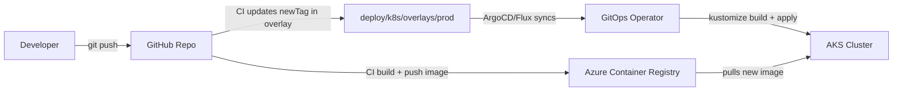

# Cloud-Native .NET Microservice — Azure 

[](https://github.com/your-org/azure-dotnetservice/actions/workflows/deploy.yml)

A repository demonstrating containerized .NET microservice deployment to **Azure Kubernetes Service (AKS)** with **GitHub Actions** and **Azure Pipelines** — designed to run fully offline with Kind when no Azure subscription is available.

## Business Impact

| Impact | Description |
|--------|-------------|
| **Faster Time-to-Market** | Automated CI/CD pipelines reduce manual deployment overhead from hours to minutes, enabling rapid feature iteration. |
| **Reduced Operational Risk** | Rolling updates with health probes ensure zero-downtime deployments. Failed releases automatically roll back. |
| **Cost Optimization** | Container resource limits (CPU/memory) prevent resource sprawl. AKS cluster auto-scaling right-sizes infrastructure to demand. |
| **Developer Velocity** | Local Kind environment mirrors production AKS, allowing developers to validate Kubernetes deployments before committing. |
| **Platform Consistency** | Same Docker image and Kubernetes manifests run identically across dev, staging, and production environments. |
| **Vendor Flexibility** | Kubernetes abstraction avoids cloud lock-in — workloads can migrate between AKS, EKS, GKE, or on-premise clusters. |

## Architecture



## Design Considerations

### Scalability
- **Horizontal Pod Autoscaling** — The microservice is stateless, enabling HPA based on CPU/memory metrics. Replica count is configurable in `deploy/k8s/deployment.yaml`.
- **Resource Requests/Limits** — CPU (100m/250m) and memory (128Mi/256Mi) guardrails prevent noisy-neighbor issues in multi-tenant clusters.
- **Stateless Design** — No session affinity required; any pod can handle any request. State is externalized to Azure services (DB, Redis, etc.) when needed.

### Reliability
- **Health Probes** — Liveness (every 15s) restarts dead pods. Readiness (every 10s) removes unhealthy pods from the service load balancer.
- **Rolling Updates** — `maxUnavailable: 0, maxSurge: 1` ensures zero-downtime deployments. One new pod spins up before any old pod is terminated.
- **Container Restart Policy** — `Always` ensures failed containers automatically recover without manual intervention.

### Security
- **Immutable Infrastructure** — No SSH into pods. All configuration is baked into the container image or injected via environment variables.
- **Image Pull Policy** — `IfNotPresent` prevents unnecessary registry pulls and avoids pulling tampered images in production.
- **Principle of Least Privilege** — Containers run without elevated privileges. Network policies can further restrict inter-pod communication.

### Observability
- **Health Endpoint** — `/health` returns HTTP 200 when the application is ready, integrated with both K8s probes and Azure Monitor.
- **Structured Logging** — ASP.NET Core logs are emitted to stdout/stderr, collected by Azure Monitor or Fluentd, and searchable in Log Analytics.
- **Distributed Tracing** — The service is instrumented for OpenTelemetry, enabling end-to-end trace correlation across microservices.

### CI/CD
- **Conditional Pipelines** — Build and test run on every PR. Azure deployment steps activate only when credentials are configured, allowing fork-friendly contribution.
- **Idempotent Deployments** — `kustomize build | kubectl apply -f -` ensures manifests are declarative. Re-running the pipeline produces the same result.
- **GitOps by Default** — Image tags are separated from manifests via Kustomize overlays. The CI pipeline updates the `newTag` in the prod overlay, ready for ArgoCD/Flux to sync. See [GitOps section](#gitops-extension).

## What's Demonstrated

| Capability | Live Azure | Local (Kind) |
|------------|:----------:|:-------------:|
| .NET build & test | ✅ | ✅ |
| Docker container build | ✅ | ✅ |
| Push to Azure Container Registry | ✅ | — |
| Deploy to AKS | ✅ | — |
| Deploy to local Kind cluster | — | ✅ |
| Rolling updates & health probes | ✅ | ✅ |
| GitHub Actions CI/CD | ✅ | ✅ (build + dry-run) |
| Azure Pipelines CI/CD | ✅ | ✅ (build + dry-run) |

## Project Structure

```
.
├── src/CloudNativeMicroservice/      # .NET 8 Web API
├── argocd/                           # ArgoCD declarative config
│   ├── project.yaml                  # AppProject (RBAC scoping)
│   └── application.yaml              # Application (sync policy, ignore diffs)
├── .github/workflows/deploy.yml      # GitHub Actions pipeline
├── azure-pipelines.yml               # Azure DevOps pipeline
├── deploy/k8s/
│   ├── base/                         # Shared Kubernetes manifests
│   │   ├── kustomization.yaml
│   │   ├── namespace.yaml            # sync-wave: 0
│   │   ├── deployment.yaml           # sync-wave: 1
│   │   └── service.yaml              # sync-wave: 1
│   ├── overlays/
│   │   ├── dev/                      # Dev environment (1 replica)
│   │   │   └── kustomization.yaml
│   │   ├── prod/                     # Production (3 replicas, HPA, PDB, NetworkPolicy)
│   │   │   ├── kustomization.yaml
│   │   │   ├── hpa.yaml              # sync-wave: 2
│   │   │   ├── pdb.yaml              # sync-wave: 2
│   │   │   └── network-policy.yaml   # sync-wave: 2
│   │   └── kind/                     # Local Kind overlay (local image tag)
│   │       └── kustomization.yaml
│   ├── deployment.yaml               # Standalone manifest (backward compat)
│   └── service.yaml                  # Standalone manifest (backward compat)
├── scripts/local-demo.sh             # Full local demo script
├── docker-compose.yml                # Local container testing
├── Dockerfile                        # Multi-stage container build
└── Makefile                          # Task runner
```

## Run Without Azure

### Prerequisites

- [Docker](https://docker.com)
- [Kind](https://kind.sigs.k8s.io) — `go install sigs.k8s.io/kind@latest`
- [.NET 8 SDK](https://dotnet.microsoft.com/download)

### One-command demo

```bash
make kind-demo
```

This runs the full flow: builds the app → runs tests → builds Docker image → creates a Kind cluster → deploys the K8s manifests → tests the API endpoint.

### Step by step

```bash
# Build and test locally
make build && make test

# Run via Docker
make docker-run

# Deploy to local Kind cluster
make kind-up
make kind-deploy

# Tear down
make kind-destroy
```

### Manual script

```bash
./scripts/local-demo.sh
```

## Deploy to Azure (when subscription is available)

### GitHub Actions

Set these [repository secrets](https://docs.github.com/en/actions/security-guides/using-secrets-in-github-actions):

| Secret | Purpose |
|--------|---------|
| `AZURE_CREDENTIALS` | Azure service principal (JSON) |
| `ACR_LOGIN_SERVER` | e.g. `myacr.azurecr.io` |
| `ACR_USERNAME` | ACR admin username |
| `ACR_PASSWORD` | ACR admin password |
| `AKS_CLUSTER_NAME` | AKS cluster name |
| `AKS_RESOURCE_GROUP` | AKS resource group |

The workflow runs **build + test** unconditionally, and only pushes to ACR / deploys to AKS when secrets are present.

### Azure Pipelines

Set pipeline variables (`acrLoginServer`, `aksClusterName`, etc.) via the Azure DevOps portal. The pipeline conditionally skips the Deploy stage if AKS isn't configured.

## GitOps Extension

This repository implements **GitOps** practices out of the box. Kubernetes manifests use **Kustomize** overlays for environment-specific configuration, with the image tag separated from the base manifests — the core of a pull-based GitOps workflow.

### How GitOps is Applied Here

| Principle | Implementation |
|-----------|---------------|
| **Declarative config** | All K8s resources defined as YAML in `deploy/k8s/` |
| **Version controlled** | Everything in Git — full audit trail of changes |
| **Image tag separation** | Base manifests use generic image; overlays set `newTag` via Kustomize |
| **Environment parity** | Same base manifests across dev/prod/kind — only overlay values differ |
| **Drift detection ready** | Namespace, labels, and selectors structured for ArgoCD/Flux sync |
| **CI/CD idempotency** | `kustomize build | kubectl apply -f -` is safe to re-run |

### Adopting ArgoCD

The `argocd/` directory contains declarative manifests to register the application with ArgoCD. Update the repo URL in `application.yaml` to match your fork, then apply:

```bash
kubectl apply -f argocd/project.yaml
kubectl apply -f argocd/application.yaml
```

ArgoCD will sync the `deploy/k8s/overlays/prod` Kustomize overlay and automatically:
- Create the `cloud-native-microservice` namespace (sync-wave 0)
- Deploy the Deployment and Service (sync-wave 1)
- Apply HPA, PDB, and NetworkPolicy (sync-wave 2)
- Prune resources that no longer exist in Git
- Self-heal if manual changes are detected

#### Sync Wave Ordering

| Wave | Resources | Purpose |
|------|-----------|---------|
| 0 | Namespace | Foundation — must exist before anything else |
| 1 | Deployment, Service | Core workload + networking |
| 2 | HPA, PDB, NetworkPolicy | Auxiliary — depend on the deployment existing |

#### ignoring Differences

The Application is configured to ignore fields that the cluster may auto-populate differently than Git:
- `spec.replicas` on Deployments (allows HPA to manage replica count)
- `spec.metrics` on HPAs (allows cluster-specific metric variations)

### Adopting Flux

```bash
flux bootstrap github \
  --owner=your-org \
  --repository=azure-dotnetservice \
  --path=deploy/k8s/overlays/prod \
  --personal
```

Once the operator is installed, the CI pipeline (`update-gitops-manifest` job in `.github/workflows/deploy.yml`) builds the image, pushes it to ACR, and updates the `newTag` in `deploy/k8s/overlays/prod/kustomization.yaml`. The operator detects the drift and auto-syncs the cluster.

### Kustomize Overlay Reference

| Overlay | Image | Replicas | Extra Resources | Use Case |
|---------|-------|----------|-----------------|----------|
| `overlays/dev` | `myacr.azurecr.io/...:latest` | 1 | — | Development |
| `overlays/prod` | `myacr.azurecr.io/...:<sha>` | 3 | HPA, PDB, NetworkPolicy | Production |
| `overlays/kind` | `cloud-native-microservice:local` | 1 | — | Local Kind testing |

### GitOps Architecture (with ArgoCD/Flux)



### Benefits of GitOps for this repo

| Benefit | How it applies |
|---------|----------------|
| **Audit Trail** | Every manifest change is a git commit — full history of who changed what and when. |
| **Drift Detection** | ArgoCD/Flux continuously compare cluster state to git. Manual changes are reverted automatically. |
| **Multi-Environment** | Use separate branches or directories for dev/staging/prod with promotion via PRs. |
| **Disaster Recovery** | Spin up a new cluster and point ArgoCD at the repo — the entire workload is restored automatically. |
| **PR-Based Deployments** | Open a PR to change replica count or image tag; merge triggers the sync. |

## Kubernetes Manifests

| File | Description |
|------|-------------|
| `base/deployment.yaml` | Shared deployment — RollingUpdate, `/health` probes, resource limits |
| `base/service.yaml` | Shared ClusterIP service on port 80 → container port 8080 |
| `base/namespace.yaml` | Dedicated `cloud-native-microservice` namespace |
| `overlays/prod/hpa.yaml` | CPU/memory-based Horizontal Pod Autoscaler (3–10 replicas) |
| `overlays/prod/pdb.yaml` | Pod Disruption Budget (min 2 available during voluntary disruptions) |
| `overlays/prod/network-policy.yaml` | Ingress traffic restricted to same-namespace pods only |
| `argocd/project.yaml` | ArgoCD AppProject with source/destination RBAC scoping |
| `argocd/application.yaml` | ArgoCD Application with sync policy, retry, and ignore-differences |
