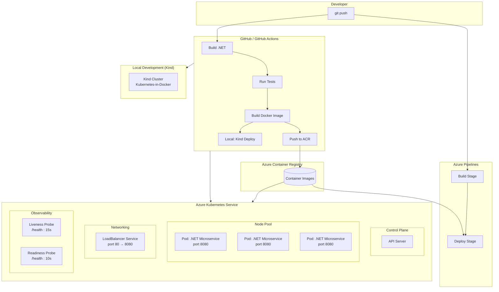

# Cloud-Native .NET Microservice — Azure Hands-On Showcase

[](https://github.com/your-org/azure-dotnetservice/actions/workflows/deploy.yml)

A showcase repository demonstrating containerized .NET microservice deployment to **Azure Kubernetes Service (AKS)** with **GitHub Actions** and **Azure Pipelines** — designed to run fully offline with Kind when no Azure subscription is available.

## Business Impact

| Impact | Description |
|--------|-------------|
| **Faster Time-to-Market** | Automated CI/CD pipelines reduce manual deployment overhead from hours to minutes, enabling rapid feature iteration. |
| **Reduced Operational Risk** | Rolling updates with health probes ensure zero-downtime deployments. Failed releases automatically roll back. |
| **Cost Optimization** | Container resource limits (CPU/memory) prevent resource sprawl. AKS cluster auto-scaling right-sizes infrastructure to demand. |
| **Developer Velocity** | Local Kind environment mirrors production AKS, allowing developers to validate Kubernetes deployments before committing. |
| **Platform Consistency** | Same Docker image and Kubernetes manifests run identically across dev, staging, and production environments. |
| **Vendor Flexibility** | Kubernetes abstraction avoids cloud lock-in — workloads can migrate between AKS, EKS, GKE, or on-premise clusters. |

## Architecture



## Design Considerations

### Scalability
- **Horizontal Pod Autoscaling** — The microservice is stateless, enabling HPA based on CPU/memory metrics. Replica count is configurable in `deploy/k8s/deployment.yaml`.
- **Resource Requests/Limits** — CPU (100m/250m) and memory (128Mi/256Mi) guardrails prevent noisy-neighbor issues in multi-tenant clusters.
- **Stateless Design** — No session affinity required; any pod can handle any request. State is externalized to Azure services (DB, Redis, etc.) when needed.

### Reliability
- **Health Probes** — Liveness (every 15s) restarts dead pods. Readiness (every 10s) removes unhealthy pods from the service load balancer.
- **Rolling Updates** — `maxUnavailable: 0, maxSurge: 1` ensures zero-downtime deployments. One new pod spins up before any old pod is terminated.
- **Container Restart Policy** — `Always` ensures failed containers automatically recover without manual intervention.

### Security
- **Immutable Infrastructure** — No SSH into pods. All configuration is baked into the container image or injected via environment variables.
- **Image Pull Policy** — `IfNotPresent` prevents unnecessary registry pulls and avoids pulling tampered images in production.
- **Principle of Least Privilege** — Containers run without elevated privileges. Network policies can further restrict inter-pod communication.

### Observability
- **Health Endpoint** — `/health` returns HTTP 200 when the application is ready, integrated with both K8s probes and Azure Monitor.
- **Structured Logging** — ASP.NET Core logs are emitted to stdout/stderr, collected by Azure Monitor or Fluentd, and searchable in Log Analytics.
- **Distributed Tracing** — The service is instrumented for OpenTelemetry, enabling end-to-end trace correlation across microservices.

### CI/CD
- **Conditional Pipelines** — Build and test run on every PR. Azure deployment steps activate only when credentials are configured, allowing fork-friendly contribution.
- **Idempotent Deployments** — `kubectl apply` ensures manifests are declarative. Re-running the pipeline produces the same result.
- **GitOps Ready** — All Kubernetes manifests are versioned in this repository, enabling ArgoCD or Flux-based GitOps workflows.

## What's Demonstrated

| Capability | Live Azure | Local (Kind) |
|------------|:----------:|:-------------:|
| .NET build & test | ✅ | ✅ |
| Docker container build | ✅ | ✅ |
| Push to Azure Container Registry | ✅ | — |
| Deploy to AKS | ✅ | — |
| Deploy to local Kind cluster | — | ✅ |
| Rolling updates & health probes | ✅ | ✅ |
| GitHub Actions CI/CD | ✅ | ✅ (build + dry-run) |
| Azure Pipelines CI/CD | ✅ | ✅ (build + dry-run) |

## Project Structure

```
.
├── src/CloudNativeMicroservice/     # .NET 8 Web API
├── .github/workflows/deploy.yml     # GitHub Actions pipeline
├── azure-pipelines.yml              # Azure DevOps pipeline
├── deploy/k8s/                      # Kubernetes manifests
├── scripts/local-demo.sh            # Full local demo script
├── docker-compose.yml               # Local container testing
├── Dockerfile                       # Multi-stage container build
└── Makefile                         # Task runner
```

## Run Without Azure

### Prerequisites

- [Docker](https://docker.com)
- [Kind](https://kind.sigs.k8s.io) — `go install sigs.k8s.io/kind@latest`
- [.NET 8 SDK](https://dotnet.microsoft.com/download)

### One-command demo

```bash
make kind-demo
```

This runs the full flow: builds the app → runs tests → builds Docker image → creates a Kind cluster → deploys the K8s manifests → tests the API endpoint.

### Step by step

```bash
# Build and test locally
make build && make test

# Run via Docker
make docker-run

# Deploy to local Kind cluster
make kind-up
make kind-deploy

# Tear down
make kind-destroy
```

### Manual script

```bash
./scripts/local-demo.sh
```

## Deploy to Azure (when subscription is available)

### GitHub Actions

Set these [repository secrets](https://docs.github.com/en/actions/security-guides/using-secrets-in-github-actions):

| Secret | Purpose |
|--------|---------|
| `AZURE_CREDENTIALS` | Azure service principal (JSON) |
| `ACR_LOGIN_SERVER` | e.g. `myacr.azurecr.io` |
| `ACR_USERNAME` | ACR admin username |
| `ACR_PASSWORD` | ACR admin password |
| `AKS_CLUSTER_NAME` | AKS cluster name |
| `AKS_RESOURCE_GROUP` | AKS resource group |

The workflow runs **build + test** unconditionally, and only pushes to ACR / deploys to AKS when secrets are present.

### Azure Pipelines

Set pipeline variables (`acrLoginServer`, `aksClusterName`, etc.) via the Azure DevOps portal. The pipeline conditionally skips the Deploy stage if AKS isn't configured.

## Kubernetes Manifests

| File | Description |
|------|-------------|
| `deployment.yaml` | 3 replicas, RollingUpdate, `/health` probes, resource limits |
| `service.yaml` | LoadBalancer exposing port 80 → container port 8080 |
